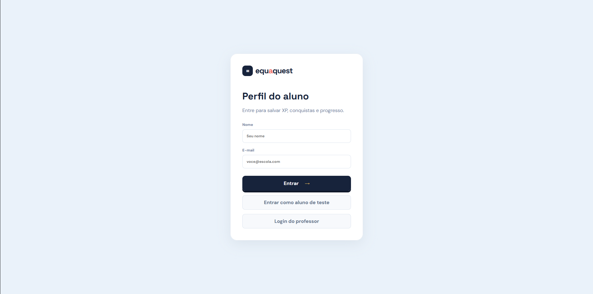
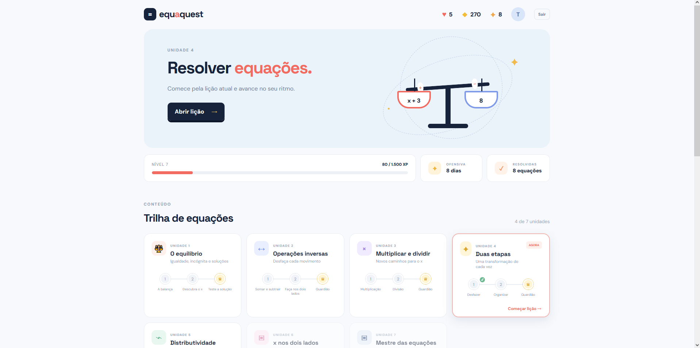
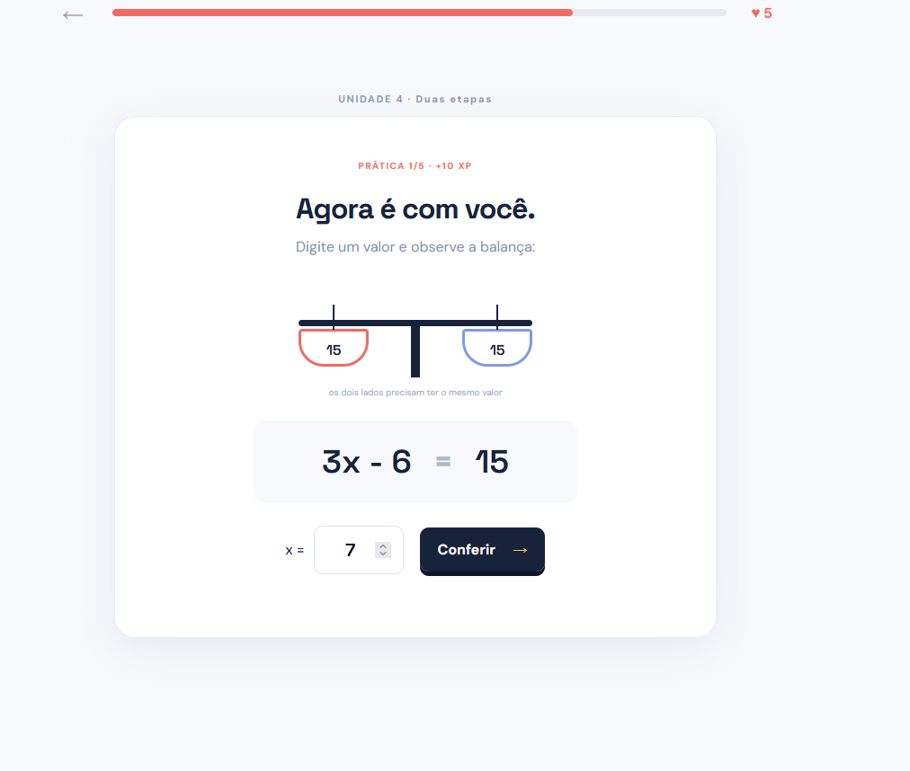
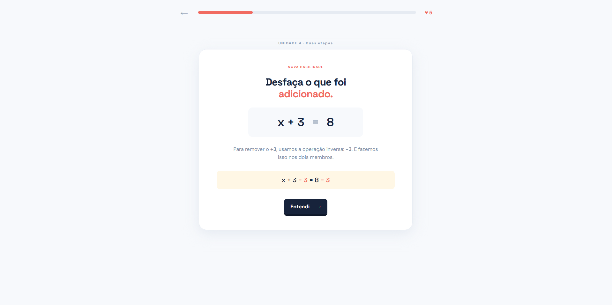
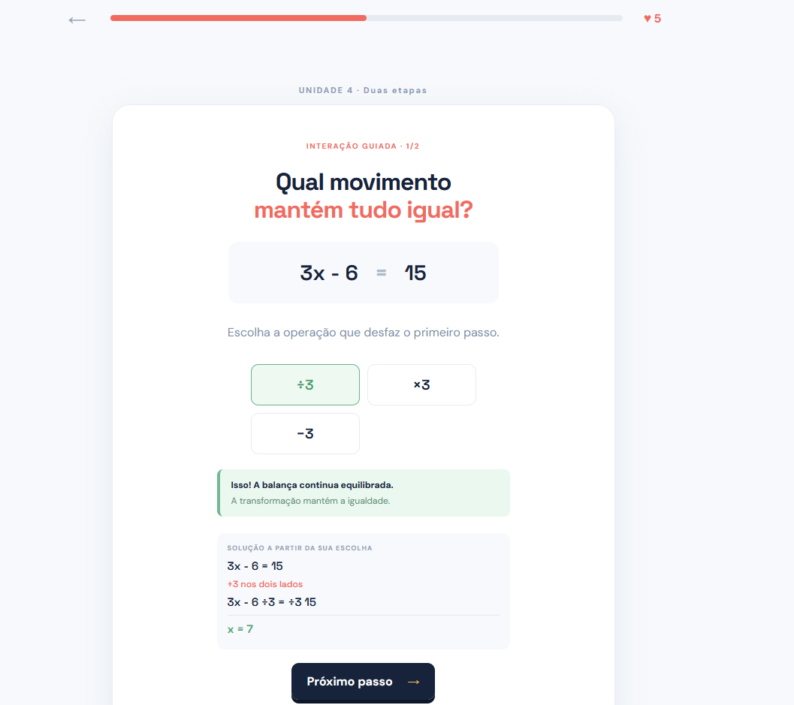
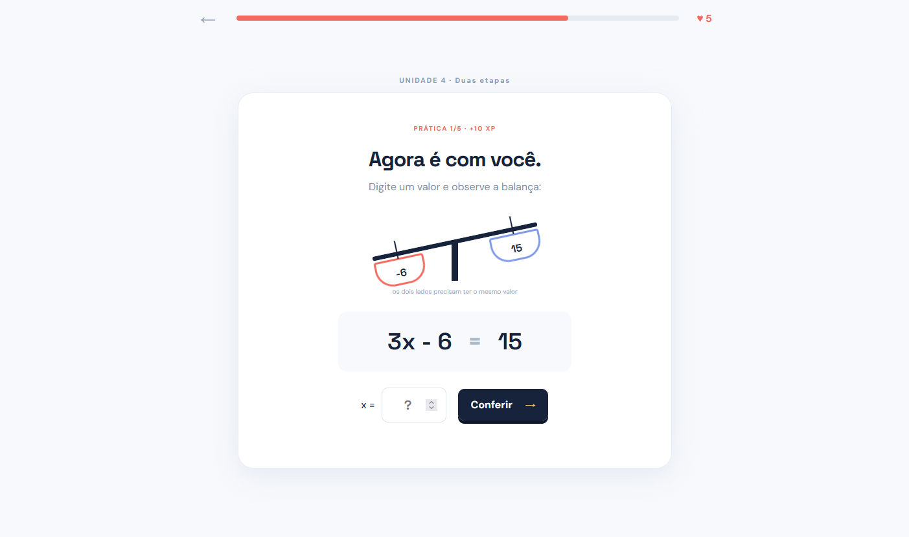

# EquaQuest: matemática transformada em jogo

O EquaQuest é uma plataforma educacional gamificada criada para tornar o aprendizado de matemática mais envolvente, visual e significativo. Com foco no ensino de equações do primeiro grau, a experiência combina trilhas de aprendizagem, desafios interativos, recompensas e acompanhamento do progresso.

## Uma jornada de aprendizagem

O aluno começa criando ou acessando seu perfil. Depois, encontra uma trilha organizada em unidades progressivas: equilíbrio, operações inversas, multiplicação e divisão, equações em duas etapas, distributividade, incógnita nos dois lados e desafios finais.

Cada unidade apresenta uma habilidade específica e permite que o estudante avance gradualmente, consolidando o conhecimento antes de enfrentar problemas mais complexos.

## A balança como metáfora visual

A balança interativa representa o princípio fundamental de uma equação: os dois lados precisam permanecer em equilíbrio. O aluno visualiza a expressão, digita sua resposta e observa o efeito do valor informado.

Essa representação transforma um conceito abstrato em uma experiência concreta. Quando a resposta está correta, os dois lados se alinham; quando há erro, o desequilíbrio ajuda a indicar que o raciocínio precisa ser revisto.

## Aprendizagem guiada e prática

Antes de resolver sozinho, o aluno passa por uma explicação e por uma interação guiada. A plataforma mostra qual operação deve ser aplicada nos dois lados da igualdade e apresenta feedback imediato.

Depois, chega o momento de praticar. O estudante digita o valor de `x`, confere a resposta e recebe uma explicação clara. O acerto gera XP, moedas e progresso na trilha.

## Gamificação com propósito

O EquaQuest utiliza XP, moedas, corações, sequências de estudo e conquistas para tornar o esforço visível e estimular a continuidade. Esses elementos não substituem o conteúdo: eles apoiam a motivação e ajudam o aluno a perceber sua evolução.

## Banco de questões e acompanhamento

A plataforma possui um banco amplo de questões distribuídas por unidades e níveis de dificuldade. O estudante pratica adição, subtração, multiplicação, divisão, equações em duas etapas, distributividade e incógnitas nos dois lados.

O sistema registra questões resolvidas, XP, moedas, unidade atual, tentativas e desempenho por unidade. Professores podem criar turmas, adicionar alunos, atribuir trilhas e acompanhar o desenvolvimento da classe.

## Conclusão

O EquaQuest transforma o estudo de equações em uma experiência interativa, progressiva e envolvente. Por meio das trilhas, da balança visual, dos desafios, do feedback imediato e da gamificação, o aluno aprende não apenas qual é a resposta, mas por que ela está correta.

Mais do que resolver exercícios, o estudante aprende a pensar matematicamente, testar hipóteses, corrigir erros e avançar no próprio ritmo.
